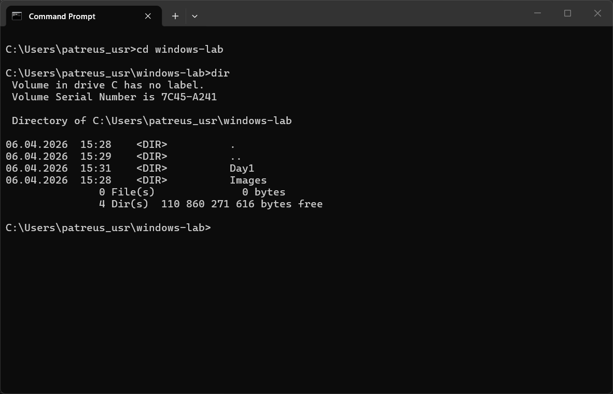
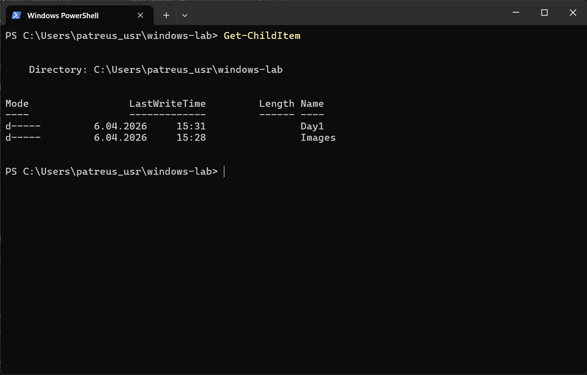

# Day 1 - Practice

## Screenshots

Below are examples of basic Windows navigation using CMD and PowerShell.

### CMD - directory listing


### PowerShell - directory listing


## What I did
- created windows-lab folder
- created day1, day2, day3 directories
- explored Windows directories
- used CMD and PowerShell

---

## Commands used
CMD:
```bash
dir      # displays files and directories in the current location (CMD)
```

PowerShell:
```bash
Get-ChildItem      # lists files and directories with structured output (PowerShell)
```

---

## Observations
- Windows stores users in C:\Users
- programs are in Program Files
- system is in C:\Windows

---

## Summary
I successfully prepared my local Windows lab environment and learned basic system navigation using CMD and PowerShell.
