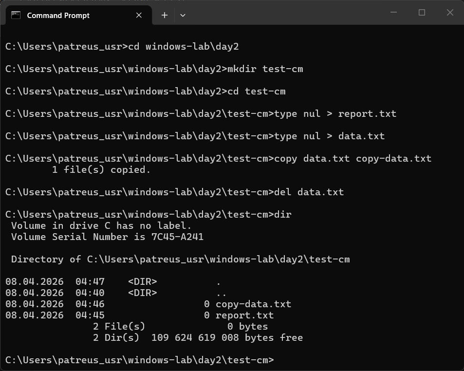
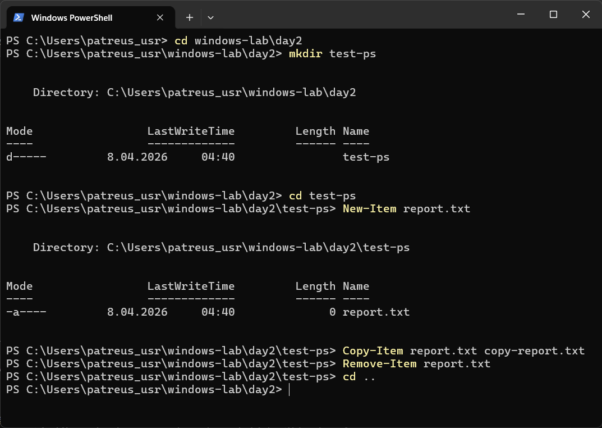

# Day 2 - Practice

## Screenshots

Below are examples of file system navigation and file operations using CMD and PowerShell.





---

## What I did
- navigated through directories using cd and Set-Location
- created folders and files
- copied and deleted files
- used both CMD and PowerShell

---

## Commands used

CMD:
```bash
cd - change directory
dir - list files
mkdir - create folder
copy - copy file
del - delete file
```

PowerShell:
```bash
Set-Location - change directory
Get-ChildItem - list files
New-Item - create file/folder
Copy-Item - copy file
Remove-Item - delete file
```

---

## Observations
- CMD and PowerShell can perform the same tasks
- PowerShell provides more structured output
- file paths are essential for navigation

---

## Summary
I practiced navigating the Windows file system and performing basic file operations.
